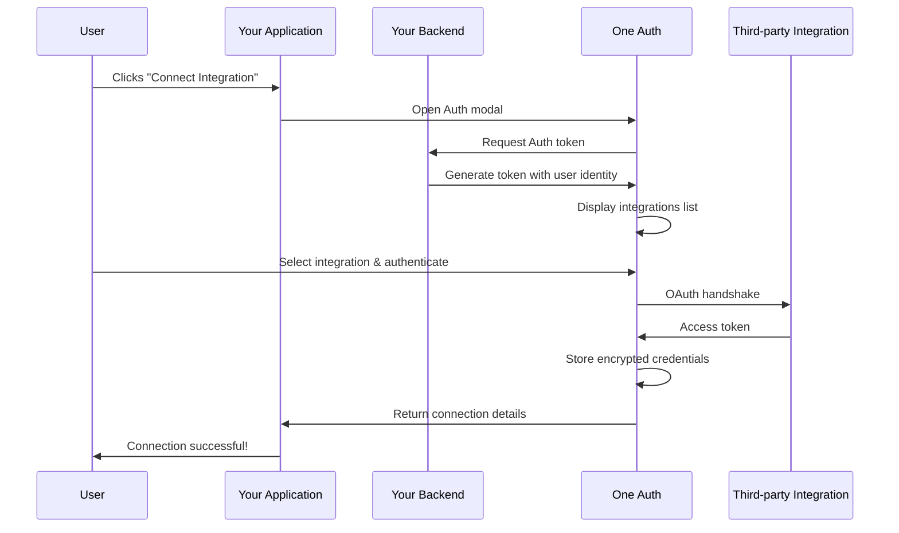

<h3 align="center">One Auth</h3>

<p align="center">
  <a href="https://withone.ai"><strong>Website</strong></a>
  &nbsp;·&nbsp;
  <a href="https://withone.ai/docs/auth"><strong>Docs</strong></a>
  &nbsp;·&nbsp;
  <a href="https://app.withone.ai"><strong>Dashboard</strong></a>
  &nbsp;·&nbsp;
  <a href="https://withone.ai/changelog"><strong>Changelog</strong></a>
  &nbsp;·&nbsp;
  <a href="https://x.com/withoneai"><strong>X</strong></a>
  &nbsp;·&nbsp;
  <a href="https://linkedin.com/company/withoneai"><strong>LinkedIn</strong></a>
</p>

<p align="center">
  <a href="https://npmjs.com/package/@withone/auth"></a>
</p>

One Auth is a pre-built, embeddable authentication UI that makes it easy for your users to securely connect their third-party accounts (Gmail, Slack, Salesforce, QuickBooks, etc.) directly within your application.

Fully compatible with popular frameworks such as React, Next.js, Vue, Svelte, and more.

## Install

With npm:

```bash
npm i @withone/auth
```

With yarn:

```bash
yarn add @withone/auth
```

## Using the Auth component

Replace the `token URL` with your backend token endpoint URL (must be a full URL, not a relative path).

```tsx
"use client";

import { useOneAuth } from "@withone/auth";

const USER_ID = "your-user-uuid";

export function ConnectIntegrationButton() {
  const { open } = useOneAuth({
    token: {
      url: "https://your-domain.com/api/authkit",
      headers: {
        "x-user-id": USER_ID,
      },
    },
    onSuccess: (connection) => {
      console.log("Connection created:", connection);
    },
    onError: (error) => {
      console.error("Connection failed:", error);
    },
    onClose: () => {
      console.log("Auth modal closed");
    },
  });

  return <button onClick={open}>Connect Integration</button>;
}
```

### Configuration Options

| Option | Type | Description |
|---|---|---|
| `token.url` | `string` | Full URL of your backend token endpoint |
| `token.headers` | `object` | Headers to send with the token request (e.g., user ID) |
| `selectedConnection` | `string` | Pre-select an integration by display name (e.g., `"Gmail"`) |
| `appTheme` | `"dark" \| "light"` | Theme for the Auth modal |
| `onSuccess` | `(connection) => void` | Callback when a connection is successfully created |
| `onError` | `(error) => void` | Callback when the connection fails |
| `onClose` | `() => void` | Callback when the modal is closed |

## Backend Token Generation

To enable Auth connections, your backend needs an endpoint that generates a session token by calling the One API.

### Environment Variables

```env
ONE_SECRET_KEY=sk_test_your_secret_key_here
ONE_API_BASE_URL=https://api.withone.ai
```

| Variable | Description |
|---|---|
| `ONE_SECRET_KEY` | Your secret key from the [One dashboard](https://app.withone.ai/settings/api-keys) |
| `ONE_API_BASE_URL` | One API base URL (`https://api.withone.ai`) |

### API Route — `POST /api/authkit`

Your backend endpoint should:

1. Extract the `x-user-id` header to identify the user
2. Call `POST {ONE_API_BASE_URL}/v1/authkit/token` with your secret key and the user's identity
3. Return the token to the client

**Request headers:**

| Header | Required | Description |
|---|---|---|
| `x-user-id` | Yes | Unique identifier for the user (e.g., UUID from your auth system) |

**Example cURL:**

```bash
curl -X POST "https://your-domain.com/api/authkit" \
  -H "Content-Type: application/json" \
  -H "x-user-id: f47ac10b-58cc-4372-a567-0e02b2c3d479"
```

**Token API call (from your backend):**

```typescript
const response = await fetch(`${ONE_API_BASE_URL}/v1/authkit/token`, {
  method: "POST",
  headers: {
    "Content-Type": "application/json",
    "X-One-Secret": ONE_SECRET_KEY,
  },
  body: JSON.stringify({
    identity: userId,
    identityType: "user", // "user" | "team" | "organization" | "project"
  }),
});

const token = await response.json();
return token;
```

**Success response (200):**

```json
{
  "token": "ey...",
  ...
}
```

### CORS Headers

Your token endpoint must include CORS headers since the Auth iframe calls it directly:

```
Access-Control-Allow-Origin: *
Access-Control-Allow-Methods: POST, OPTIONS
Access-Control-Allow-Headers: Content-Type, Authorization, x-user-id
```

## Diagram



## License

This project is licensed under the GPL-3.0 license. See the [LICENSE](LICENSE) file for details.
