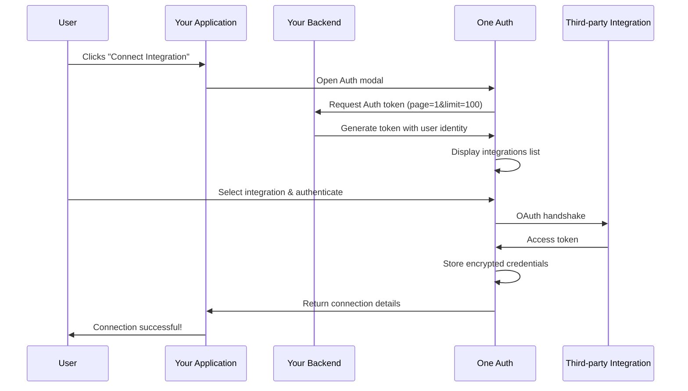

<h3 align="center">One Auth</h3>

<p align="center">
  <a href="https://withone.ai"><strong>Website</strong></a>
  &nbsp;·&nbsp;
  <a href="https://withone.ai/docs/auth"><strong>Docs</strong></a>
  &nbsp;·&nbsp;
  <a href="https://app.withone.ai"><strong>Dashboard</strong></a>
  &nbsp;·&nbsp;
  <a href="https://withone.ai/changelog"><strong>Changelog</strong></a>
  &nbsp;·&nbsp;
  <a href="https://x.com/withoneai"><strong>X</strong></a>
  &nbsp;·&nbsp;
  <a href="https://linkedin.com/company/withoneai"><strong>LinkedIn</strong></a>
</p>

<p align="center">
  <a href="https://npmjs.com/package/@withone/auth"></a>
</p>

One Auth is a pre-built, embeddable authentication UI that makes it easy for your users to securely connect their third-party accounts (Gmail, Slack, Salesforce, QuickBooks, etc.) directly within your application.

Fully compatible with popular frameworks such as React, Next.js, Vue, Svelte, and more.

## Install

With npm:

```bash
npm i @withone/auth
```

With yarn:

```bash
yarn add @withone/auth
```

## Getting Started with the Skill

The easiest way to integrate One Auth is by installing the skill for your AI coding agent. The skill provides step-by-step guidance for setting up the backend token endpoint, frontend component, and connection handling.

```bash
npx skills add withoneai/auth
```

Once installed, your AI coding agent will have full context on how to set up and work with One Auth in your project.

## Using the Auth component

Replace the `token URL` with your backend token endpoint URL.

> ⚠️ **Must be a full URL** — relative paths like `/api/one-auth` won't work because the Auth widget runs in an iframe on a different domain. Use the complete URL (e.g., `https://your-domain.com/api/one-auth`).

```tsx
"use client";

import { useOneAuth } from "@withone/auth";

const USER_ID = "your-user-uuid";

export function ConnectIntegrationButton() {
  const { open } = useOneAuth({
    token: {
      url: "https://your-domain.com/api/one-auth",
      headers: {
        "x-user-id": USER_ID,
      },
    },
    onSuccess: (connection) => {
      console.log("Connection created:", connection);
    },
    onError: (error) => {
      console.error("Connection failed:", error);
    },
    onClose: () => {
      console.log("Auth modal closed");
    },
  });

  return <button onClick={open}>Connect Integration</button>;
}
```

### Configuration Options

| Option | Type | Description |
|---|---|---|
| `token.url` | `string` | Full URL of your backend token endpoint |
| `token.headers` | `object` | Headers to send with the token request (e.g., user ID) |
| `selectedConnection` | `string` | Pre-select an integration by display name (e.g., `"Gmail"`) |
| `appTheme` | `"dark" \| "light"` | Theme for the Auth modal |
| `title` | `string` | Custom title for the modal |
| `imageUrl` | `string` | Custom logo URL to display in the modal |
| `companyName` | `string` | Your company name to display in the modal |
| `authWindow` | `"same" \| "popup"` | How the OAuth provider is opened. Defaults to `"same"` (top-level redirect, returns to the original page). Pass `"popup"` to open in a separate window instead. |
| `onSuccess` | `(connection) => void` | Callback when a connection is successfully created |
| `onError` | `(error) => void` | Callback when the connection fails |
| `onClose` | `() => void` | Callback when the modal is closed |

## Backend Token Generation

To enable Auth connections, your backend needs an endpoint that generates a session token by calling the One API.

### Environment Variables

```env
ONE_SECRET_KEY=sk_test_your_secret_key_here
```

| Variable | Description |
|---|---|
| `ONE_SECRET_KEY` | Your secret key from the [One dashboard](https://app.withone.ai/settings/api-keys) |

### API Route — `POST /api/one-auth`

Your backend endpoint should:

1. Extract the `x-user-id` header to identify the user
2. Handle pagination — the Auth widget sends `page` and `limit` as query parameters
3. Call `POST https://api.withone.ai/v1/authkit/token` with your secret key and the user's identity
4. Return the token response to the client

**Request headers:**

| Header | Required | Description |
|---|---|---|
| `x-user-id` | Yes | Unique identifier for the user (e.g., UUID from your auth system) |

**Query parameters (sent automatically by the widget):**

| Parameter | Description |
|---|---|
| `page` | Current page number for paginated integration list |
| `limit` | Number of integrations per page |

**Example implementation (Next.js):**

```typescript
import { NextRequest, NextResponse } from "next/server";

const corsHeaders = {
  "Access-Control-Allow-Origin": "*",
  "Access-Control-Allow-Methods": "POST, OPTIONS",
  "Access-Control-Allow-Headers": "Content-Type, Authorization, x-user-id",
};

export async function OPTIONS() {
  return NextResponse.json({}, { headers: corsHeaders });
}

export async function POST(req: NextRequest) {
  try {
    const userId = req.headers.get("x-user-id");

    if (!userId) {
      return NextResponse.json(
        { error: "Unauthorized" },
        { status: 401, headers: corsHeaders }
      );
    }

    // The Auth widget sends pagination params as query parameters
    const page = req.nextUrl.searchParams.get("page");
    const limit = req.nextUrl.searchParams.get("limit");

    const response = await fetch(
      `https://api.withone.ai/v1/authkit/token?page=${page}&limit=${limit}`,
      {
        method: "POST",
        headers: {
          "Content-Type": "application/json",
          "X-One-Secret": process.env.ONE_SECRET_KEY!,
        },
        body: JSON.stringify({
          identity: userId,
          identityType: "user", // "user" | "team" | "organization" | "project"
        }),
      }
    );

    if (!response.ok) {
      return NextResponse.json(
        { error: "Failed to generate token" },
        { status: response.status, headers: corsHeaders }
      );
    }

    const token = await response.json();
    return NextResponse.json(token, { headers: corsHeaders });
  } catch (error) {
    return NextResponse.json(
      { error: "Failed to generate token" },
      { status: 500, headers: corsHeaders }
    );
  }
}
```

**Success response (200):**

```json
{
  "rows": [
    {
      "id": 41596,
      "connectionDefId": 34,
      "type": "api",
      "title": "ActiveCampaign",
      "image": "https://assets.withone.ai/connectors/activecampaign.svg",
      "environment": "test",
      "tags": [],
      "active": true
    },
    {
      "id": 41524,
      "connectionDefId": 109,
      "type": "api",
      "title": "Anthropic",
      "image": "https://assets.withone.ai/connectors/anthropic.svg",
      "environment": "test",
      "tags": [],
      "active": true
    }
  ],
  "total": 247,
  "pages": 3,
  "page": 1,
  "requestId": 110256
}
```

The response includes a paginated list of available integrations. The widget handles pagination automatically by calling your token endpoint with different `page` values.

## Configuration & Management

All configuration for the Auth component is managed via the **[One Dashboard](https://app.withone.ai/settings/authkit)**. From the dashboard, you can:

- **Choose which apps are visible** — Select which integrations appear in the Auth modal for your users
- **Configure OAuth credentials** — Use One's default client ID and client secret, or bring your own for any integration
- **Adjust scopes** — Customize the OAuth scopes requested for each integration

AuthKit configuration is scoped at the **project level**, enabling multi-tenant architecture. Each project in your One account can have its own set of visible apps, OAuth credentials, and scopes — allowing you to serve different configurations to different products or customer segments from a single account.

> **Dashboard link:** [app.withone.ai/settings/authkit](https://app.withone.ai/settings/authkit)

## Diagram



## License

This project is licensed under the GPL-3.0 license. See the [LICENSE](LICENSE) file for details.
